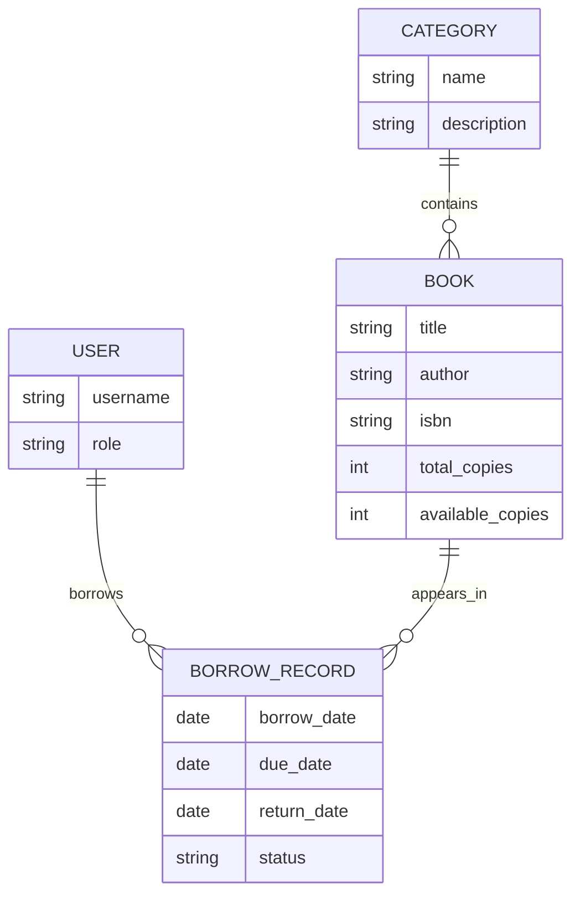
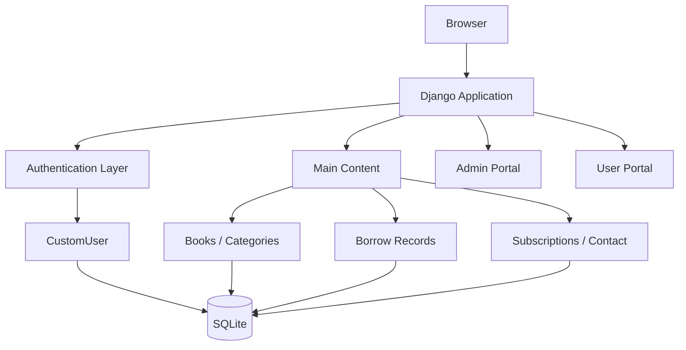

# OpenLib — Library Management System

A full-stack library management application built with **Python and Django**, featuring custom authentication, role-based dashboards, book circulation tracking, email workflows, and administrative analytics.

OpenLib was built to explore backend application architecture with Django beyond basic CRUD operations, including custom user models, relational data modeling, authorization, form handling, and application configuration.

---

## Features

### Authentication & Roles

OpenLib uses a custom Django user model with two application roles:

* **Admin**
* **User**

Authenticated users are routed to role-appropriate functionality, while administrative views validate the user's role before granting access.

---

### Library Management

The domain model includes:

* Books
* Categories
* Users
* Borrow records
* Availability tracking
* Borrow / return status
* Due dates
* Overdue status



---

### Admin Dashboard

The administrative dashboard provides a high-level view of library activity, including:

* total books;
* registered users;
* currently issued books;
* overdue borrow records.

Administrative routes require authentication and an appropriate application role.

---

### User Portal

Regular users have a dedicated application area separate from administrative functionality.

This separation keeps normal library interaction independent from management workflows.

---

### Email Workflows

OpenLib supports:

* newsletter/email subscriptions;
* duplicate subscription detection;
* contact-form submissions;
* confirmation emails;
* administrative copies of contact submissions.

SMTP configuration is supplied through environment variables rather than committed credentials.

---

## Application Architecture



The project is divided into Django applications with separate responsibilities:

| App           | Responsibility                                                                       |
| ------------- | ------------------------------------------------------------------------------------ |
| `maincontent` | Public pages, books, categories, borrow records, subscriptions and contact workflows |
| `signup`      | Custom user model, authentication and registration                                   |
| `adminpanel`  | Administrative dashboard and management functionality                                |
| `userpage`    | User-facing library portal                                                           |
| `Openlib`     | Project configuration, URLs, WSGI/ASGI and settings                                  |

---

## Tech Stack

| Layer          | Technology                      |
| -------------- | ------------------------------- |
| Backend        | Python, Django 5.2              |
| Database       | SQLite                          |
| Frontend       | HTML5, CSS3, JavaScript         |
| Rendering      | Django Templates                |
| Authentication | Django Auth + Custom User Model |
| Email          | Django Email Backend / SMTP     |
| Development    | Django Debug Toolbar            |
| Type Checking  | django-stubs / Pyright          |

---

## Project Structure

```text
OpenLib/
├── Openlib/              # Django project configuration
│   ├── settings.py
│   ├── urls.py
│   ├── asgi.py
│   └── wsgi.py
│
├── maincontent/          # Core library domain + public pages
│   ├── models.py
│   ├── forms.py
│   ├── views.py
│   └── templates/
│
├── signup/               # Authentication + custom user model
│   ├── models.py
│   ├── forms.py
│   ├── views.py
│   └── templates/
│
├── adminpanel/           # Administrative portal
│   ├── views.py
│   └── templates/
│
├── userpage/             # User portal
│   ├── views.py
│   └── templates/
│
├── static/               # Application static assets
├── .env.example          # Environment configuration reference
├── .gitignore
├── requirements.txt
└── manage.py
```

---

## Getting Started

### 1. Clone the repository

```bash
git clone https://github.com/Faiz-Shaikh-001/OpenLib.git
cd OpenLib
```

### 2. Create a virtual environment

```bash
python3 -m venv .venv
source .venv/bin/activate
```

Windows PowerShell:

```powershell
python -m venv .venv
.\.venv\Scripts\Activate.ps1
```

### 3. Install dependencies

```bash
pip install -r requirements.txt
```

### 4. Configure environment variables

At minimum, OpenLib requires a Django secret key.

Linux/macOS:

```bash
export SECRET_KEY="your-local-development-secret"
export DEBUG="True"
```

PowerShell:

```powershell
$env:SECRET_KEY="your-local-development-secret"
$env:DEBUG="True"
```

Optional SMTP configuration:

```text
EMAIL_USE_TLS=True
EMAIL_HOST=smtp.gmail.com
EMAIL_HOST_USER=your-email@example.com
EMAIL_HOST_PASSWORD=your-app-password
EMAIL_PORT=587
```

Never commit production credentials or application secrets.

### 5. Apply migrations

```bash
python manage.py migrate
```

### 6. Create an administrator

```bash
python manage.py createsuperuser
```

### 7. Run the application

```bash
python manage.py runserver
```

Then open:

```text
http://127.0.0.1:8000/
```

---

## Engineering Concepts Demonstrated

OpenLib demonstrates practical use of:

* custom Django user models;
* authentication and authorization;
* relational database modeling;
* foreign-key relationships;
* role-aware routing;
* server-side form validation;
* SMTP/email integration;
* environment-based secret configuration;
* Django application separation;
* ORM queries and aggregate dashboard metrics.

---

## Security

Application secrets and SMTP credentials are loaded from environment variables rather than being committed to source control.

The repository ignores local environment files, databases, virtual environments, generated static files, and development-specific configuration.

For a production deployment, additional hardening would be required, including:

* production `ALLOWED_HOSTS`;
* HTTPS configuration;
* production database configuration;
* secure cookies;
* CSRF configuration;
* production static-file handling;
* stricter deployment settings.

---

